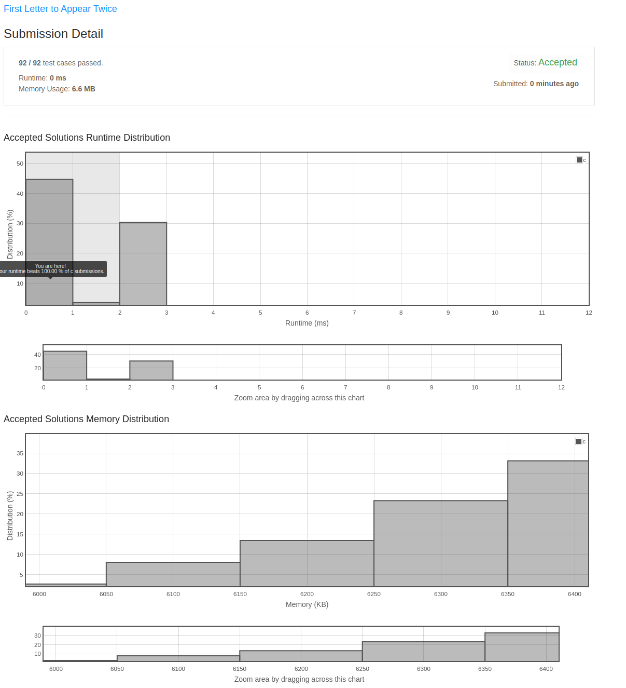

## First Letter to Appear Twice

Given a string s consisting of lowercase English letters, return the first letter to appear twice.

**Note:**

A letter a appears twice before another letter b if the second occurrence of a is before the second occurrence of b.
s will contain at least one letter that appears twice.

**Example 1:**

**Input:** s = "abccbaacz"
**Output:** "c"
**Explanation:**
The letter 'a' appears on the indexes 0, 5 and 6.
The letter 'b' appears on the indexes 1 and 4.
The letter 'c' appears on the indexes 2, 3 and 7.
The letter 'z' appears on the index 8.
The letter 'c' is the first letter to appear twice, because out of all the letters the index of its second occurrence is the smallest.

**Example 2:**

**Input:** s = "abcdd"
**Output:** "d"
**Explanation:**
The only letter that appears twice is 'd' so we return 'd'.

**Constraints:**

2 <= s.length <= 100
s consists of lowercase English letters.
s has at least one repeated letter.

### My Solution

Last year sometime I made my solution to this and included it in a local repo.  I recently grabbed some commits from
that repo and injected them into this new remote with some bug fixes ano other stuff.  I have a bunch of these problems
that I plan to do the same for.

I also submitted my solution onto LeetCode and got the following report:

Runtime: 0 ms, faster than 100.00% of C online submissions for First Letter to Appear Twice.
Memory Usage: 6.6 MB, less than 19.64% of C online submissions for First Letter to Appear Twice.

