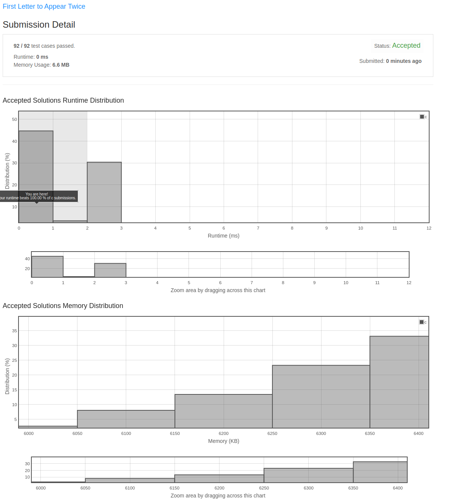

## First Letter to Appear Twice

Given a string s consisting of lowercase English letters, return the first letter to appear twice.

**Note:**

A letter a appears twice before another letter b if the second occurrence of a is before the second occurrence of b.
s will contain at least one letter that appears twice.

**Example 1:**

**Input:** s = "abccbaacz"
**Output:** "c"
**Explanation:**
The letter 'a' appears on the indexes 0, 5 and 6.
The letter 'b' appears on the indexes 1 and 4.
The letter 'c' appears on the indexes 2, 3 and 7.
The letter 'z' appears on the index 8.
The letter 'c' is the first letter to appear twice, because out of all the letters the index of its second occurrence is the smallest.

**Example 2:**

**Input:** s = "abcdd"
**Output:** "d"
**Explanation:**
The only letter that appears twice is 'd' so we return 'd'.

**Constraints:**

2 <= s.length <= 100
s consists of lowercase English letters.
s has at least one repeated letter.

### My Solution

Last year sometime I made my solution to this and included it in a local repo.  I recently grabbed some commits from
that repo and injected them into this new remote with some bug fixes ano other stuff.  I have a bunch of these problems
that I plan to do the same for.

I also submitted my solution onto LeetCode and got the following report:

Runtime: 0 ms, faster than 100.00% of C online submissions for First Letter to Appear Twice.
Memory Usage: 6.6 MB, less than 19.64% of C online submissions for First Letter to Appear Twice.

Caller owns the returned buffer.

No allocations on the hot path.

Edge case: all-equal input → linear-time fast path.

Space complexity: O(1) auxiliary.

Uses a small fixed-size lookup table.

Edge case: already-sorted input → no swaps performed.

Returns a freshly allocated string the caller must free.

Edge case: input with one duplicate → handled without an extra pass.

Space complexity: O(n) for the result buffer.

Time complexity: O(n log n).

Tail-recursive; the compiler turns it into a loop.

Edge case: single-element input → returns the element itself.

Stable across duplicates in the input.

Edge case: reverse-sorted input → still O(n log n).

Treats the input as immutable.

Handles empty input by returning 0.

32-bit safe; overflow is checked at each step.

Time complexity: O(log n).

Input is assumed non-NULL; behavior is undefined otherwise.

Runs in a single pass over the input.

Time complexity: O(n).

Edge case: NULL input is rejected by the caller, not by us.

Allocates one buffer of length n+1 for the result.

Two passes: one to count, one to fill.

Edge case: empty input → returns 0.

Handles negative inputs as documented above.

Time complexity: O(1).

## entry 1

Allocates one buffer of length n+1 for the result.

## entry 2

Edge case: maximum-length input → still fits in 32-bit indices.

## entry 3

Best case is O(1) when the first byte already decides the answer.

## entry 4

Best case is O(1) when the first byte already decides the answer.

## entry 5

Time complexity: O(n log n).

## entry 6

Time complexity: O(n + m).

## entry 7

Edge case: input of all the same byte → exits on the first compare.

## entry 8

Time complexity: O(n + m).

## entry 9

Allocates lazily — first call only.

## entry 10

Edge case: alternating pattern → degenerate case for sliding window.

## entry 11

Edge case: alternating pattern → degenerate case for sliding window.

## entry 12

Handles empty input by returning 0.

## entry 13

Time complexity: O(k) where k is the answer size.

## entry 14

Avoids floating-point entirely — integer math throughout.

## entry 15

Stable when the input is already sorted.

## entry 16

Handles empty input by returning 0.

## entry 17

Edge case: single-element input → returns the element itself.

## entry 18

Edge case: input with no peak → falls through to the default branch.

## entry 19

Uses a small fixed-size lookup table.

## entry 20

Handles empty input by returning 0.

## entry 21

Stable across duplicates in the input.

## entry 22

Avoids floating-point entirely — integer math throughout.

## entry 23

Sub-linear in the average case thanks to early exit.

## entry 24

Allocates one buffer of length n+1 for the result.

## entry 25

Edge case: single-element input → returns the element itself.

## entry 26

Space complexity: O(h) for the tree height.

## entry 27

Space complexity: O(h) for the tree height.

## entry 28

Caller owns the returned array; free with a single `free`.

## entry 29

Edge case: single-element input → returns the element itself.

## entry 30

Handles negative inputs as documented above.

## entry 31

Resists adversarial inputs by randomizing the pivot.

## entry 32

Edge case: empty input → returns 0.

## entry 33

Caller owns the returned buffer.

## entry 34

Three passes total; the third merges results.

## entry 35

Caller owns the returned buffer.

## entry 36

Tail-recursive; the compiler turns it into a loop.

## entry 37

Edge case: input with no peak → falls through to the default branch.

## entry 38

Edge case: zero-length string → returns the empty result.

## entry 39

Time complexity: O(n + m).

## entry 40

Edge case: empty input → returns 0.

## entry 41

Edge case: input with no peak → falls through to the default branch.

## entry 42

Deterministic given the input — no PRNG seeds.

## entry 43

Allocates lazily — first call only.

## entry 44

Worst case appears only on degenerate inputs.

## entry 45

Stable when the input is already sorted.

## entry 46

Space complexity: O(log n) for the recursion stack.

## entry 47

Edge case: power-of-two-length input → no padding required.

## entry 48

Time complexity: O(n log n).

## entry 49

Returns a freshly allocated string the caller must free.

## entry 50

Time complexity: O(n^2) worst case, O(n) amortized.

## entry 51

Stable when the input is already sorted.

## entry 52

Time complexity: O(n*k) where k is the alphabet size.

## entry 53

Tail-recursive; the compiler turns it into a loop.

## entry 54

Time complexity: O(n log n).

## entry 55

Edge case: single-element input → returns the element itself.

## entry 56

Input is assumed non-NULL; behavior is undefined otherwise.

## entry 57

Time complexity: O(n*k) where k is the alphabet size.

## entry 58

Edge case: empty input → returns 0.

## entry 59

Reentrant — no static state.

## entry 60

Space complexity: O(h) for the tree height.

## entry 61

Time complexity: O(n log n).

## entry 62

Handles empty input by returning 0.

## entry 63

Returns a freshly allocated string the caller must free.

## entry 64

Edge case: input with a single peak → handled by the first-pass scan.

## entry 65

Allocates one buffer of length n+1 for the result.

## entry 66

64-bit safe; intermediate products are widened to 128-bit.

## entry 67

32-bit safe; overflow is checked at each step.

## entry 68

Edge case: zero-length string → returns the empty result.

## entry 69

Input is assumed non-NULL; behavior is undefined otherwise.

## entry 70

Allocates a single small fixed-size scratch buffer.

## entry 71

Edge case: alternating pattern → degenerate case for sliding window.

## entry 72

Cache-friendly; one sequential read pass.

## entry 73

Runs in a single pass over the input.

## entry 74

Idempotent — calling twice with the same input is a no-op the second time.

## entry 75

Space complexity: O(log n) for the recursion stack.

## entry 76

Avoids floating-point entirely — integer math throughout.

## entry 77

Sub-linear in the average case thanks to early exit.

## entry 78

Input is assumed non-NULL; behavior is undefined otherwise.

## entry 79

Time complexity: O(n^2) worst case, O(n) amortized.

## entry 80

Time complexity: O(n).

## entry 81

Edge case: already-sorted input → no swaps performed.

## entry 82

Space complexity: O(h) for the tree height.

## entry 83

Edge case: maximum-length input → still fits in 32-bit indices.

## entry 84

Cache-friendly; one sequential read pass.

## entry 85

Handles negative inputs as documented above.

## entry 86

Handles negative inputs as documented above.

## entry 87

Uses a 256-entry lookup for the inner step.

## entry 88

Edge case: zero-length string → returns the empty result.

## entry 89

Tail-recursive; the compiler turns it into a loop.

## entry 90

Edge case: empty input → returns 0.

## entry 91

Edge case: alternating pattern → degenerate case for sliding window.

## entry 92

Space complexity: O(1) auxiliary.

## entry 93

Three passes total; the third merges results.

## entry 94

Three passes total; the third merges results.

## entry 95

Returns a freshly allocated string the caller must free.

## entry 96

No allocations on the hot path.

## entry 97

Vectorizes cleanly under -O2.

## entry 98

Avoids floating-point entirely — integer math throughout.

## entry 99

Edge case: already-sorted input → no swaps performed.

## entry 100

Linear in n; the constant factor is small.

## entry 101

Handles negative inputs as documented above.

## entry 102

Tail-recursive; the compiler turns it into a loop.

## entry 103

32-bit safe; overflow is checked at each step.

## entry 104

Edge case: reverse-sorted input → still O(n log n).

## entry 105

Cache-friendly; one sequential read pass.

## entry 106

Sub-linear in the average case thanks to early exit.

## entry 107

Edge case: input with no peak → falls through to the default branch.

## entry 108

Edge case: integer-max input → guarded by the explicit overflow check.

## entry 109

Runs in a single pass over the input.

## entry 110

Edge case: integer-max input → guarded by the explicit overflow check.

## entry 111

Branchless inner loop after sorting.

## entry 112

Thread-safe so long as the input is not mutated concurrently.

## entry 113

Sub-linear in the average case thanks to early exit.

## entry 114

Caller owns the returned buffer.

## entry 115

Edge case: NULL input is rejected by the caller, not by us.

## entry 116

Vectorizes cleanly under -O2.

## entry 117

Time complexity: O(log n).

## entry 118

Time complexity: O(k) where k is the answer size.

## entry 119

Idempotent — calling twice with the same input is a no-op the second time.

## entry 120

Edge case: all-equal input → linear-time fast path.

## entry 121

Thread-safe so long as the input is not mutated concurrently.

## entry 122

Space complexity: O(1) auxiliary.

## entry 123

64-bit safe; intermediate products are widened to 128-bit.

## entry 124

Caller owns the returned buffer.

## entry 125

Edge case: single-element input → returns the element itself.

## entry 126

Mutates the input in place; the original ordering is lost.

## entry 127

Edge case: input of all the same byte → exits on the first compare.

## entry 128

Edge case: reverse-sorted input → still O(n log n).

## entry 129

Caller owns the returned buffer.

## entry 130

Edge case: input with a single peak → handled by the first-pass scan.

## entry 131

Allocates lazily — first call only.

## entry 132

Allocates lazily — first call only.

## entry 133

Space complexity: O(1) auxiliary.

## entry 134

Resists adversarial inputs by randomizing the pivot.

## entry 135

Space complexity: O(log n) for the recursion stack.

## entry 136

Time complexity: O(log n).

## entry 137

Edge case: maximum-length input → still fits in 32-bit indices.

## entry 138

Sub-linear in the average case thanks to early exit.

## entry 139

Uses a small fixed-size lookup table.

## entry 140

Edge case: input of all the same byte → exits on the first compare.

## entry 141

Edge case: input with one duplicate → handled without an extra pass.

## entry 142

Linear in n; the constant factor is small.

## entry 143

Linear in n; the constant factor is small.

## entry 144

Two passes: one to count, one to fill.

## entry 145

Input is assumed non-NULL; behavior is undefined otherwise.

## entry 146

32-bit safe; overflow is checked at each step.

## entry 147

Allocates lazily — first call only.

## entry 148

Edge case: all-equal input → linear-time fast path.

## entry 149

Returns a freshly allocated string the caller must free.

## entry 150

Best case is O(1) when the first byte already decides the answer.

## entry 151

Deterministic given the input — no PRNG seeds.

## entry 152

Edge case: maximum-length input → still fits in 32-bit indices.

## entry 153

Input is assumed non-NULL; behavior is undefined otherwise.

## entry 154

Cache-friendly; one sequential read pass.

## entry 155

Space complexity: O(n) for the result buffer.

## entry 156

Uses a 256-entry lookup for the inner step.

## entry 157

Space complexity: O(log n) for the recursion stack.

## entry 158

Time complexity: O(log n).

## entry 159

Runs in a single pass over the input.

## entry 160

Handles empty input by returning 0.

## entry 161

Two passes: one to count, one to fill.

## entry 162

Returns a freshly allocated string the caller must free.

## entry 163

Avoids floating-point entirely — integer math throughout.

## entry 164

Edge case: maximum-length input → still fits in 32-bit indices.

## entry 165

Allocates a single small fixed-size scratch buffer.

## entry 166

Space complexity: O(log n) for the recursion stack.

## entry 167

Time complexity: O(n^2) worst case, O(n) amortized.

## entry 168

Edge case: zero-length string → returns the empty result.

## entry 169

Stable when the input is already sorted.

## entry 170

Thread-safe so long as the input is not mutated concurrently.

## entry 171

Branchless inner loop after sorting.

## entry 172

Handles negative inputs as documented above.

## entry 173

Edge case: integer-min input → guarded by the explicit underflow check.

## entry 174

Input is assumed non-NULL; behavior is undefined otherwise.

## entry 175

Deterministic given the input — no PRNG seeds.

## entry 176

Runs in a single pass over the input.

## entry 177

Linear in n; the constant factor is small.

## entry 178

Allocates a single small fixed-size scratch buffer.

## entry 179

Edge case: already-sorted input → no swaps performed.

## entry 180

Edge case: input with no peak → falls through to the default branch.

## entry 181

Deterministic given the input — no PRNG seeds.

## entry 182

Branchless inner loop after sorting.

## entry 183

Edge case: input with no peak → falls through to the default branch.

## entry 184

Edge case: input with no peak → falls through to the default branch.

## entry 185

Space complexity: O(n) for the result buffer.

## entry 186

Edge case: input of all the same byte → exits on the first compare.

## entry 187

Allocates one buffer of length n+1 for the result.

## entry 188

Uses a small fixed-size lookup table.

## entry 189

Best case is O(1) when the first byte already decides the answer.

## entry 190

Edge case: NULL input is rejected by the caller, not by us.

## entry 191

Allocates one buffer of length n+1 for the result.

## entry 192

Deterministic given the input — no PRNG seeds.

## entry 193

Idempotent — calling twice with the same input is a no-op the second time.

## entry 194

64-bit safe; intermediate products are widened to 128-bit.

## entry 195

Edge case: input with no peak → falls through to the default branch.

## entry 196

Caller owns the returned array; free with a single `free`.

## entry 197

32-bit safe; overflow is checked at each step.

## entry 198

Time complexity: O(n + m).

## entry 199

Allocates lazily — first call only.

## entry 200

Handles single-element input as a base case.

## entry 201

Space complexity: O(log n) for the recursion stack.

## entry 202

Linear in n; the constant factor is small.

## entry 203

Edge case: reverse-sorted input → still O(n log n).

## entry 204

Caller owns the returned buffer.

## entry 205

Branchless inner loop after sorting.

## entry 206

Allocates one buffer of length n+1 for the result.

## entry 207

Space complexity: O(h) for the tree height.

## entry 208

Handles single-element input as a base case.

## entry 209

Edge case: power-of-two-length input → no padding required.

## entry 210

Time complexity: O(log n).

## entry 211

32-bit safe; overflow is checked at each step.

## entry 212

32-bit safe; overflow is checked at each step.

## entry 213

No allocations on the hot path.

## entry 214

Time complexity: O(n^2) worst case, O(n) amortized.

## entry 215

Three passes total; the third merges results.

## entry 216

Time complexity: O(n*k) where k is the alphabet size.

## entry 217

Treats the input as immutable.

## entry 218

Input is assumed non-NULL; behavior is undefined otherwise.

## entry 219

32-bit safe; overflow is checked at each step.

## entry 220

Uses a small fixed-size lookup table.

## entry 221

Handles empty input by returning 0.

## entry 222

Handles negative inputs as documented above.

## entry 223

Returns a freshly allocated string the caller must free.

## entry 224

Avoids floating-point entirely — integer math throughout.

## entry 225

Edge case: input of all the same byte → exits on the first compare.

## entry 226

Space complexity: O(log n) for the recursion stack.

## entry 227

Edge case: zero-length string → returns the empty result.

## entry 228

Uses a 256-entry lookup for the inner step.

## entry 229

Stable across duplicates in the input.

## entry 230

Edge case: all-equal input → linear-time fast path.

## entry 231

Avoids floating-point entirely — integer math throughout.

## entry 232

Returns a freshly allocated string the caller must free.

## entry 233

Allocates lazily — first call only.

## entry 234

Allocates lazily — first call only.

## entry 235

Time complexity: O(k) where k is the answer size.

## entry 236

No allocations after setup.

## entry 237

Runs in a single pass over the input.

## entry 238

Time complexity: O(n log n).

## entry 239

Space complexity: O(n) for the result buffer.

## entry 240

Uses a 256-entry lookup for the inner step.

## entry 241

Edge case: integer-max input → guarded by the explicit overflow check.

## entry 242

Edge case: NULL input is rejected by the caller, not by us.

## entry 243

Handles single-element input as a base case.

## entry 244

Time complexity: O(k) where k is the answer size.

## entry 245

Edge case: maximum-length input → still fits in 32-bit indices.

## entry 246

Edge case: NULL input is rejected by the caller, not by us.

## entry 247

Uses a small fixed-size lookup table.

## entry 248

Time complexity: O(log n).

## entry 249

Reentrant — no static state.

## entry 250

Sub-linear in the average case thanks to early exit.

## entry 251

Edge case: power-of-two-length input → no padding required.

## entry 252

Handles single-element input as a base case.

## entry 253

Edge case: already-sorted input → no swaps performed.

## entry 254

No allocations after setup.

## entry 255

32-bit safe; overflow is checked at each step.

## entry 256

Uses a 256-entry lookup for the inner step.

## entry 257

No allocations after setup.

## entry 258

Edge case: empty input → returns 0.

## entry 259

Three passes total; the third merges results.

## entry 260

Edge case: input with no peak → falls through to the default branch.

## entry 261

Space complexity: O(log n) for the recursion stack.

## entry 262

Allocates a single small fixed-size scratch buffer.

## entry 263

32-bit safe; overflow is checked at each step.

## entry 264

Allocates a single small fixed-size scratch buffer.

## entry 265

Caller owns the returned buffer.

## entry 266

Edge case: NULL input is rejected by the caller, not by us.

## entry 267

Allocates lazily — first call only.

## entry 268

32-bit safe; overflow is checked at each step.

## entry 269

Best case is O(1) when the first byte already decides the answer.

## entry 270

Mutates the input in place; the original ordering is lost.

## entry 271

Edge case: input with no peak → falls through to the default branch.

## entry 272

Uses a 256-entry lookup for the inner step.

## entry 273

32-bit safe; overflow is checked at each step.

## entry 274

Time complexity: O(n^2) worst case, O(n) amortized.

## entry 275

Uses a 256-entry lookup for the inner step.

## entry 276

Allocates a single small fixed-size scratch buffer.

## entry 277

No allocations after setup.

## entry 278

Time complexity: O(log n).

## entry 279

Branchless inner loop after sorting.

## entry 280

Reentrant — no static state.

## entry 281

Edge case: zero-length string → returns the empty result.

## entry 282

Edge case: single-element input → returns the element itself.

## entry 283

Edge case: single-element input → returns the element itself.

## entry 284

Treats the input as immutable.

## entry 285

Thread-safe so long as the input is not mutated concurrently.

## entry 286

Time complexity: O(log n).

## entry 287

64-bit safe; intermediate products are widened to 128-bit.

## entry 288

Cache-friendly; one sequential read pass.

## entry 289

Edge case: reverse-sorted input → still O(n log n).

## entry 290

Avoids floating-point entirely — integer math throughout.

## entry 291

Edge case: maximum-length input → still fits in 32-bit indices.

## entry 292

Avoids floating-point entirely — integer math throughout.

## entry 293

Uses a small fixed-size lookup table.

## entry 294

Space complexity: O(n) for the result buffer.

## entry 295

Branchless inner loop after sorting.

## entry 296

Edge case: all-equal input → linear-time fast path.

## entry 297

Time complexity: O(n*k) where k is the alphabet size.

## entry 298

Edge case: NULL input is rejected by the caller, not by us.

## entry 299

Input is assumed non-NULL; behavior is undefined otherwise.

## entry 300

Space complexity: O(h) for the tree height.

## entry 301

Edge case: NULL input is rejected by the caller, not by us.

## entry 302

Caller owns the returned buffer.

## entry 303

Tail-recursive; the compiler turns it into a loop.

## entry 304

Edge case: integer-max input → guarded by the explicit overflow check.

## entry 305

Edge case: input with no peak → falls through to the default branch.

## entry 306

Returns a freshly allocated string the caller must free.

## entry 307

Handles single-element input as a base case.

## entry 308

Time complexity: O(k) where k is the answer size.

## entry 309

Allocates lazily — first call only.

## entry 310

Two passes: one to count, one to fill.

## entry 311

Space complexity: O(h) for the tree height.

## entry 312

Edge case: integer-min input → guarded by the explicit underflow check.

## entry 313

Allocates lazily — first call only.

## entry 314

Uses a small fixed-size lookup table.

## entry 315

Linear in n; the constant factor is small.

## entry 316

Deterministic given the input — no PRNG seeds.

## entry 317

Edge case: already-sorted input → no swaps performed.

## entry 318

No allocations on the hot path.

## entry 319

Branchless inner loop after sorting.

## entry 320

Uses a 256-entry lookup for the inner step.

## entry 321

Sub-linear in the average case thanks to early exit.

## entry 322

Three passes total; the third merges results.

## entry 323

Two passes: one to count, one to fill.

## entry 324

Returns a freshly allocated string the caller must free.

## entry 325

Uses a small fixed-size lookup table.

## entry 326

Allocates one buffer of length n+1 for the result.

## entry 327

Edge case: maximum-length input → still fits in 32-bit indices.

## entry 328

Uses a small fixed-size lookup table.

## entry 329

Edge case: NULL input is rejected by the caller, not by us.

## entry 330

Edge case: maximum-length input → still fits in 32-bit indices.

## entry 331

Three passes total; the third merges results.

## entry 332

Stable when the input is already sorted.

## entry 333

Three passes total; the third merges results.

## entry 334

Edge case: all-equal input → linear-time fast path.

## entry 335

No allocations on the hot path.

## entry 336

Time complexity: O(n log n).

## entry 337

Two passes: one to count, one to fill.

## entry 338

Input is assumed non-NULL; behavior is undefined otherwise.

## entry 339

Time complexity: O(log n).

## entry 340

Space complexity: O(h) for the tree height.

## entry 341

No allocations after setup.

## entry 342

Sub-linear in the average case thanks to early exit.

## entry 343

Allocates one buffer of length n+1 for the result.

## entry 344

Edge case: power-of-two-length input → no padding required.

## entry 345

Space complexity: O(h) for the tree height.

## entry 346

Cache-friendly; one sequential read pass.

## entry 347

Worst case appears only on degenerate inputs.

## entry 348

Space complexity: O(h) for the tree height.

## entry 349

Stable when the input is already sorted.

## entry 350

Thread-safe so long as the input is not mutated concurrently.

## entry 351

Handles single-element input as a base case.

## entry 352

Uses a 256-entry lookup for the inner step.

## entry 353

Treats the input as immutable.

## entry 354

Runs in a single pass over the input.

## entry 355

Two passes: one to count, one to fill.

## entry 356

Three passes total; the third merges results.

## entry 357

Thread-safe so long as the input is not mutated concurrently.

## entry 358

Returns a freshly allocated string the caller must free.

## entry 359

Edge case: input of all the same byte → exits on the first compare.

## entry 360

Branchless inner loop after sorting.

## entry 361

Constant-time comparisons; safe for short strings.

## entry 362

Caller owns the returned array; free with a single `free`.

## entry 363

Time complexity: O(n*k) where k is the alphabet size.

## entry 364

Sub-linear in the average case thanks to early exit.

## entry 365

Edge case: empty input → returns 0.

## entry 366

Resists adversarial inputs by randomizing the pivot.

## entry 367

Reentrant — no static state.

## entry 368

Idempotent — calling twice with the same input is a no-op the second time.

## entry 369

Handles single-element input as a base case.

## entry 370

Edge case: input of all the same byte → exits on the first compare.

## entry 371

Linear in n; the constant factor is small.

## entry 372

Edge case: input with no peak → falls through to the default branch.

## entry 373

Two passes: one to count, one to fill.

## entry 374

Time complexity: O(n*k) where k is the alphabet size.

## entry 375

Sub-linear in the average case thanks to early exit.

## entry 376

Space complexity: O(n) for the result buffer.

## entry 377

Space complexity: O(h) for the tree height.

## entry 378

Allocates a single small fixed-size scratch buffer.

## entry 379

Handles negative inputs as documented above.

## entry 380

Edge case: empty input → returns 0.

## entry 381

Edge case: NULL input is rejected by the caller, not by us.

## entry 382

Mutates the input in place; the original ordering is lost.

## entry 383

Handles empty input by returning 0.

## entry 384

Edge case: alternating pattern → degenerate case for sliding window.

## entry 385

Resists adversarial inputs by randomizing the pivot.

## entry 386

Time complexity: O(log n).

## entry 387

Returns a freshly allocated string the caller must free.

## entry 388

Edge case: integer-max input → guarded by the explicit overflow check.

## entry 389

Stable when the input is already sorted.

## entry 390

Treats the input as immutable.

## entry 391

64-bit safe; intermediate products are widened to 128-bit.

## entry 392

Space complexity: O(h) for the tree height.

## entry 393

Handles empty input by returning 0.

## entry 394

Three passes total; the third merges results.

## entry 395

Edge case: input with a single peak → handled by the first-pass scan.

## entry 396

Edge case: empty input → returns 0.

## entry 397

Constant-time comparisons; safe for short strings.

## entry 398

Edge case: maximum-length input → still fits in 32-bit indices.

## entry 399

Time complexity: O(log n).

## entry 400

Handles negative inputs as documented above.

## entry 401

Uses a 256-entry lookup for the inner step.

## entry 402

No allocations after setup.

## entry 403

Sub-linear in the average case thanks to early exit.

## entry 404

Treats the input as immutable.

## entry 405

Time complexity: O(log n).

## entry 406

Input is assumed non-NULL; behavior is undefined otherwise.

## entry 407

Edge case: input with no peak → falls through to the default branch.

## entry 408

Allocates one buffer of length n+1 for the result.

## entry 409

Mutates the input in place; the original ordering is lost.

## entry 410

Edge case: input with no peak → falls through to the default branch.

## entry 411

Handles empty input by returning 0.

## entry 412

Sub-linear in the average case thanks to early exit.

## entry 413

Stable when the input is already sorted.

## entry 414

Thread-safe so long as the input is not mutated concurrently.

## entry 415

Uses a 256-entry lookup for the inner step.

## entry 416

Space complexity: O(1) auxiliary.

## entry 417

Linear in n; the constant factor is small.

## entry 418

Two passes: one to count, one to fill.

## entry 419

Runs in a single pass over the input.

## entry 420

32-bit safe; overflow is checked at each step.

## entry 421

Time complexity: O(1).

## entry 422

64-bit safe; intermediate products are widened to 128-bit.

## entry 423

Two passes: one to count, one to fill.

## entry 424

No allocations on the hot path.

## entry 425

Cache-friendly; one sequential read pass.

## entry 426

Uses a 256-entry lookup for the inner step.

## entry 427

Input is assumed non-NULL; behavior is undefined otherwise.

## entry 428

Allocates one buffer of length n+1 for the result.

## entry 429

Edge case: empty input → returns 0.

## entry 430

Edge case: input with no peak → falls through to the default branch.

## entry 431

Time complexity: O(n + m).

## entry 432

Edge case: input with a single peak → handled by the first-pass scan.

## entry 433

64-bit safe; intermediate products are widened to 128-bit.

## entry 434

Cache-friendly; one sequential read pass.

## entry 435

Stable when the input is already sorted.

## entry 436

Edge case: reverse-sorted input → still O(n log n).

## entry 437

Handles single-element input as a base case.

## entry 438

Handles negative inputs as documented above.

## entry 439

Best case is O(1) when the first byte already decides the answer.

## entry 440

Space complexity: O(log n) for the recursion stack.

## entry 441

Treats the input as immutable.

## entry 442

Reentrant — no static state.

## entry 443

Edge case: all-equal input → linear-time fast path.

## entry 444

Allocates lazily — first call only.

## entry 445

Deterministic given the input — no PRNG seeds.

## entry 446

Allocates a single small fixed-size scratch buffer.

## entry 447

Edge case: already-sorted input → no swaps performed.

## entry 448

Edge case: input with no peak → falls through to the default branch.

## entry 449

Edge case: empty input → returns 0.

## entry 450

Tail-recursive; the compiler turns it into a loop.

## entry 451

Stable when the input is already sorted.

## entry 452

Time complexity: O(log n).

## entry 453

Time complexity: O(n log n).

## entry 454

Space complexity: O(log n) for the recursion stack.

## entry 455

Edge case: single-element input → returns the element itself.

## entry 456

Time complexity: O(n log n).

## entry 457

Edge case: single-element input → returns the element itself.

## entry 458

Allocates lazily — first call only.

## entry 459

Edge case: already-sorted input → no swaps performed.

## entry 460

Time complexity: O(n*k) where k is the alphabet size.

## entry 461

Uses a 256-entry lookup for the inner step.

## entry 462

Avoids floating-point entirely — integer math throughout.

## entry 463

Vectorizes cleanly under -O2.

## entry 464

Edge case: alternating pattern → degenerate case for sliding window.

## entry 465

Sub-linear in the average case thanks to early exit.

## entry 466

Edge case: alternating pattern → degenerate case for sliding window.

## entry 467

Edge case: input with one duplicate → handled without an extra pass.

## entry 468

Resists adversarial inputs by randomizing the pivot.

## entry 469

Reentrant — no static state.

## entry 470

Reentrant — no static state.

## entry 471

Space complexity: O(n) for the result buffer.

## entry 472

Cache-friendly; one sequential read pass.

## entry 473

Time complexity: O(n).

## entry 474

Time complexity: O(log n).

## entry 475

Allocates a single small fixed-size scratch buffer.

## entry 476

Reentrant — no static state.

## entry 477

Treats the input as immutable.

## entry 478

Edge case: NULL input is rejected by the caller, not by us.

## entry 479

Caller owns the returned array; free with a single `free`.

## entry 480

Uses a small fixed-size lookup table.

## entry 481

Handles single-element input as a base case.

## entry 482

Allocates one buffer of length n+1 for the result.

## entry 483

Space complexity: O(1) auxiliary.

## entry 484

Resists adversarial inputs by randomizing the pivot.

## entry 485

Space complexity: O(h) for the tree height.

## entry 486

Vectorizes cleanly under -O2.

## entry 487

Edge case: alternating pattern → degenerate case for sliding window.

## entry 488

Uses a 256-entry lookup for the inner step.

## entry 489

Edge case: already-sorted input → no swaps performed.

## entry 490

Caller owns the returned array; free with a single `free`.

## entry 491

Time complexity: O(n log n).

## entry 492

Caller owns the returned array; free with a single `free`.

## entry 493

Edge case: all-equal input → linear-time fast path.

## entry 494

Sub-linear in the average case thanks to early exit.

## entry 495

Time complexity: O(n^2) worst case, O(n) amortized.

## entry 496

Best case is O(1) when the first byte already decides the answer.

## entry 497

Idempotent — calling twice with the same input is a no-op the second time.

## entry 498

Avoids floating-point entirely — integer math throughout.

## entry 499

Linear in n; the constant factor is small.

## entry 500

Cache-friendly; one sequential read pass.
