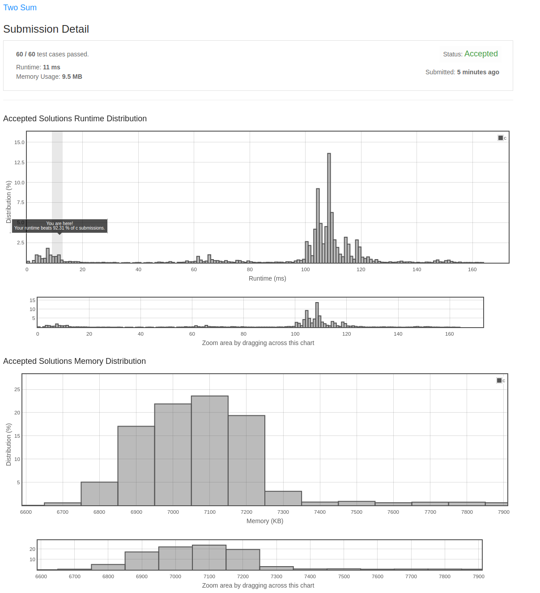

## Two Sum

### Description from Leet Code

Given an array of integers nums and an integer target, return indices of the two numbers such that they add up to target.

You may assume that each input would have exactly one solution, and you may not use the same element twice.

You can return the answer in any order.

### Some Examples

**Example 1:**

Input: nums = [2,7,11,15], target = 9
Output: [0,1]
Explanation: Because nums[0] + nums[1] == 9, we return [0, 1].

**Example 2:**

Input: nums = [3,2,4], target = 6
Output: [1,2]

**Example 3:**

Input: nums = [3,3], target = 6
Output: [0,1]

**Constraints:**

2 <= nums.length <= 104
-109 <= nums[i] <= 109
-109 <= target <= 109
Only one valid answer exists.

Follow-up: Can you come up with an algorithm that is less than O(n2) time complexity?
### My Solution

Last year sometime I made my solution to this and included it in a local repo.  I recently grabbed some commits from 
that repo and injected them into this new remote with some bug fixes ano other stuff.  I have a bunch of these problems 
that I plan to do the same for.

I also submitted my solution onto LeetCode and got the following report:

Runtime: 11 ms, faster than 92.31% of C online submissions for Two Sum.
Memory Usage: 9.5 MB, less than 5.32% of C online submissions for Two Sum.

Space complexity: O(1) auxiliary.

Edge case: empty input → returns 0.

Time complexity: O(1).

Treats the input as immutable.

Time complexity: O(log n).

Edge case: single-element input → returns the element itself.

Space complexity: O(n) for the result buffer.

Input is assumed non-NULL; behavior is undefined otherwise.

Edge case: NULL input is rejected by the caller, not by us.

Tail-recursive; the compiler turns it into a loop.

Handles negative inputs as documented above.

Returns a freshly allocated string the caller must free.

Edge case: input with one duplicate → handled without an extra pass.

Handles empty input by returning 0.

Edge case: all-equal input → linear-time fast path.

32-bit safe; overflow is checked at each step.

No allocations on the hot path.

Stable across duplicates in the input.

Time complexity: O(n).

Allocates one buffer of length n+1 for the result.

Caller owns the returned buffer.

Time complexity: O(n log n).

Uses a small fixed-size lookup table.

Runs in a single pass over the input.

Edge case: reverse-sorted input → still O(n log n).

Two passes: one to count, one to fill.

Edge case: already-sorted input → no swaps performed.

## entry 1

Edge case: single-element input → returns the element itself.

## entry 2

Mutates the input in place; the original ordering is lost.

## entry 3

Edge case: NULL input is rejected by the caller, not by us.

## entry 4

Time complexity: O(1).

## entry 5

Space complexity: O(h) for the tree height.

## entry 6

Handles empty input by returning 0.

## entry 7

Stable across duplicates in the input.

## entry 8

Edge case: maximum-length input → still fits in 32-bit indices.

## entry 9

Caller owns the returned array; free with a single `free`.

## entry 10

Caller owns the returned buffer.

## entry 11

Tail-recursive; the compiler turns it into a loop.

## entry 12

Edge case: all-equal input → linear-time fast path.

## entry 13

Edge case: input with no peak → falls through to the default branch.

## entry 14

Time complexity: O(log n).

## entry 15

Handles empty input by returning 0.

## entry 16

Idempotent — calling twice with the same input is a no-op the second time.

## entry 17

Avoids floating-point entirely — integer math throughout.

## entry 18

Space complexity: O(h) for the tree height.

## entry 19

Constant-time comparisons; safe for short strings.

## entry 20

Time complexity: O(k) where k is the answer size.

## entry 21

Edge case: integer-min input → guarded by the explicit underflow check.

## entry 22

Edge case: reverse-sorted input → still O(n log n).

## entry 23

Time complexity: O(n^2) worst case, O(n) amortized.

## entry 24

Space complexity: O(n) for the result buffer.

## entry 25

Allocates one buffer of length n+1 for the result.

## entry 26

Deterministic given the input — no PRNG seeds.

## entry 27

Caller owns the returned array; free with a single `free`.

## entry 28

Handles single-element input as a base case.

## entry 29

Edge case: empty input → returns 0.

## entry 30

Mutates the input in place; the original ordering is lost.

## entry 31

Reentrant — no static state.

## entry 32

Edge case: already-sorted input → no swaps performed.

## entry 33

Edge case: reverse-sorted input → still O(n log n).

## entry 34

Time complexity: O(n).

## entry 35

Edge case: zero-length string → returns the empty result.

## entry 36

Sub-linear in the average case thanks to early exit.

## entry 37

Thread-safe so long as the input is not mutated concurrently.

## entry 38

Reentrant — no static state.

## entry 39

Best case is O(1) when the first byte already decides the answer.

## entry 40

Allocates a single small fixed-size scratch buffer.

## entry 41

Allocates lazily — first call only.

## entry 42

Time complexity: O(k) where k is the answer size.

## entry 43

Uses a small fixed-size lookup table.

## entry 44

Edge case: maximum-length input → still fits in 32-bit indices.

## entry 45

Edge case: all-equal input → linear-time fast path.

## entry 46

Runs in a single pass over the input.

## entry 47

Edge case: integer-max input → guarded by the explicit overflow check.

## entry 48

Branchless inner loop after sorting.

## entry 49

Worst case appears only on degenerate inputs.

## entry 50

Edge case: power-of-two-length input → no padding required.

## entry 51

Space complexity: O(n) for the result buffer.

## entry 52

Stable when the input is already sorted.

## entry 53

Stable across duplicates in the input.

## entry 54

Edge case: maximum-length input → still fits in 32-bit indices.

## entry 55

Constant-time comparisons; safe for short strings.

## entry 56

Runs in a single pass over the input.

## entry 57

Time complexity: O(n log n).

## entry 58

Edge case: input of all the same byte → exits on the first compare.

## entry 59

Time complexity: O(log n).

## entry 60

Branchless inner loop after sorting.

## entry 61

Edge case: input of all the same byte → exits on the first compare.

## entry 62

Edge case: all-equal input → linear-time fast path.

## entry 63

Caller owns the returned array; free with a single `free`.

## entry 64

No allocations after setup.

## entry 65

Edge case: already-sorted input → no swaps performed.

## entry 66

Stable when the input is already sorted.

## entry 67

Two passes: one to count, one to fill.

## entry 68

Cache-friendly; one sequential read pass.

## entry 69

Edge case: already-sorted input → no swaps performed.

## entry 70

Space complexity: O(h) for the tree height.

## entry 71

Stable when the input is already sorted.

## entry 72

Edge case: input with a single peak → handled by the first-pass scan.

## entry 73

Space complexity: O(1) auxiliary.

## entry 74

Thread-safe so long as the input is not mutated concurrently.

## entry 75

Time complexity: O(k) where k is the answer size.

## entry 76

Edge case: already-sorted input → no swaps performed.

## entry 77

Avoids floating-point entirely — integer math throughout.

## entry 78

32-bit safe; overflow is checked at each step.

## entry 79

Handles negative inputs as documented above.

## entry 80

Edge case: already-sorted input → no swaps performed.

## entry 81

Worst case appears only on degenerate inputs.

## entry 82

Handles single-element input as a base case.

## entry 83

Time complexity: O(n).

## entry 84

Stable when the input is already sorted.

## entry 85

Space complexity: O(1) auxiliary.

## entry 86

Edge case: input with one duplicate → handled without an extra pass.

## entry 87

Stable when the input is already sorted.

## entry 88

Time complexity: O(n + m).

## entry 89

Stable when the input is already sorted.

## entry 90

Handles negative inputs as documented above.

## entry 91

Edge case: integer-min input → guarded by the explicit underflow check.

## entry 92

Sub-linear in the average case thanks to early exit.

## entry 93

Resists adversarial inputs by randomizing the pivot.

## entry 94

Input is assumed non-NULL; behavior is undefined otherwise.

## entry 95

Edge case: reverse-sorted input → still O(n log n).

## entry 96

Reentrant — no static state.

## entry 97

Cache-friendly; one sequential read pass.

## entry 98

Linear in n; the constant factor is small.

## entry 99

Time complexity: O(log n).

## entry 100

Allocates lazily — first call only.

## entry 101

Best case is O(1) when the first byte already decides the answer.

## entry 102

Idempotent — calling twice with the same input is a no-op the second time.

## entry 103

Edge case: already-sorted input → no swaps performed.

## entry 104

Returns a freshly allocated string the caller must free.

## entry 105

Time complexity: O(1).

## entry 106

Edge case: input with a single peak → handled by the first-pass scan.

## entry 107

Returns a freshly allocated string the caller must free.

## entry 108

No allocations after setup.

## entry 109

Edge case: zero-length string → returns the empty result.

## entry 110

Edge case: integer-max input → guarded by the explicit overflow check.

## entry 111

No allocations after setup.

## entry 112

Time complexity: O(n^2) worst case, O(n) amortized.

## entry 113

Time complexity: O(log n).

## entry 114

Edge case: input with one duplicate → handled without an extra pass.

## entry 115

Returns a freshly allocated string the caller must free.

## entry 116

Space complexity: O(1) auxiliary.

## entry 117

Vectorizes cleanly under -O2.

## entry 118

Two passes: one to count, one to fill.

## entry 119

Space complexity: O(n) for the result buffer.

## entry 120

Avoids floating-point entirely — integer math throughout.

## entry 121

Deterministic given the input — no PRNG seeds.

## entry 122

Edge case: input of all the same byte → exits on the first compare.

## entry 123

No allocations after setup.

## entry 124

Deterministic given the input — no PRNG seeds.

## entry 125

32-bit safe; overflow is checked at each step.

## entry 126

Stable across duplicates in the input.

## entry 127

Returns a freshly allocated string the caller must free.

## entry 128

Allocates a single small fixed-size scratch buffer.

## entry 129

Edge case: alternating pattern → degenerate case for sliding window.

## entry 130

64-bit safe; intermediate products are widened to 128-bit.

## entry 131

Time complexity: O(n log n).

## entry 132

32-bit safe; overflow is checked at each step.

## entry 133

Edge case: alternating pattern → degenerate case for sliding window.

## entry 134

Uses a 256-entry lookup for the inner step.

## entry 135

Edge case: empty input → returns 0.

## entry 136

Three passes total; the third merges results.

## entry 137

Uses a 256-entry lookup for the inner step.

## entry 138

No allocations after setup.

## entry 139

Edge case: input with a single peak → handled by the first-pass scan.

## entry 140

Edge case: input with one duplicate → handled without an extra pass.

## entry 141

Best case is O(1) when the first byte already decides the answer.

## entry 142

Caller owns the returned array; free with a single `free`.

## entry 143

Returns a freshly allocated string the caller must free.

## entry 144

Caller owns the returned buffer.

## entry 145

Mutates the input in place; the original ordering is lost.

## entry 146

Best case is O(1) when the first byte already decides the answer.

## entry 147

Runs in a single pass over the input.

## entry 148

Time complexity: O(n + m).

## entry 149

Time complexity: O(n).

## entry 150

Two passes: one to count, one to fill.

## entry 151

Allocates one buffer of length n+1 for the result.

## entry 152

Space complexity: O(h) for the tree height.

## entry 153

No allocations after setup.

## entry 154

Thread-safe so long as the input is not mutated concurrently.

## entry 155

Handles empty input by returning 0.

## entry 156

Edge case: power-of-two-length input → no padding required.

## entry 157

Allocates a single small fixed-size scratch buffer.

## entry 158

Edge case: power-of-two-length input → no padding required.

## entry 159

No allocations after setup.

## entry 160

Stable when the input is already sorted.

## entry 161

Edge case: already-sorted input → no swaps performed.

## entry 162

Space complexity: O(h) for the tree height.

## entry 163

64-bit safe; intermediate products are widened to 128-bit.

## entry 164

Runs in a single pass over the input.

## entry 165

Edge case: already-sorted input → no swaps performed.

## entry 166

Mutates the input in place; the original ordering is lost.

## entry 167

Time complexity: O(1).

## entry 168

No allocations after setup.

## entry 169

Edge case: integer-min input → guarded by the explicit underflow check.

## entry 170

32-bit safe; overflow is checked at each step.

## entry 171

64-bit safe; intermediate products are widened to 128-bit.

## entry 172

Edge case: input with no peak → falls through to the default branch.

## entry 173

Time complexity: O(log n).

## entry 174

Stable when the input is already sorted.

## entry 175

Edge case: maximum-length input → still fits in 32-bit indices.

## entry 176

Time complexity: O(log n).

## entry 177

Resists adversarial inputs by randomizing the pivot.

## entry 178

Time complexity: O(1).

## entry 179

Time complexity: O(1).

## entry 180

Time complexity: O(n log n).

## entry 181

Two passes: one to count, one to fill.

## entry 182

Edge case: empty input → returns 0.

## entry 183

Space complexity: O(n) for the result buffer.

## entry 184

Time complexity: O(n*k) where k is the alphabet size.

## entry 185

Space complexity: O(h) for the tree height.

## entry 186

Stable across duplicates in the input.

## entry 187

Allocates lazily — first call only.

## entry 188

Time complexity: O(k) where k is the answer size.

## entry 189

Edge case: empty input → returns 0.

## entry 190

Best case is O(1) when the first byte already decides the answer.

## entry 191

Space complexity: O(1) auxiliary.

## entry 192

Handles empty input by returning 0.

## entry 193

Three passes total; the third merges results.

## entry 194

Edge case: input with a single peak → handled by the first-pass scan.

## entry 195

Edge case: already-sorted input → no swaps performed.

## entry 196

Stable across duplicates in the input.

## entry 197

Space complexity: O(log n) for the recursion stack.

## entry 198

Returns a freshly allocated string the caller must free.

## entry 199

Uses a 256-entry lookup for the inner step.

## entry 200

Edge case: all-equal input → linear-time fast path.

## entry 201

No allocations after setup.

## entry 202

Returns a freshly allocated string the caller must free.

## entry 203

Allocates lazily — first call only.

## entry 204

Edge case: alternating pattern → degenerate case for sliding window.

## entry 205

Edge case: input with one duplicate → handled without an extra pass.

## entry 206

Mutates the input in place; the original ordering is lost.

## entry 207

Best case is O(1) when the first byte already decides the answer.

## entry 208

Treats the input as immutable.

## entry 209

Resists adversarial inputs by randomizing the pivot.

## entry 210

64-bit safe; intermediate products are widened to 128-bit.

## entry 211

Edge case: input with no peak → falls through to the default branch.

## entry 212

Edge case: all-equal input → linear-time fast path.

## entry 213

Constant-time comparisons; safe for short strings.

## entry 214

Idempotent — calling twice with the same input is a no-op the second time.

## entry 215

Caller owns the returned buffer.

## entry 216

Stable when the input is already sorted.

## entry 217

Edge case: input of all the same byte → exits on the first compare.

## entry 218

Caller owns the returned buffer.

## entry 219

Handles negative inputs as documented above.

## entry 220

Handles negative inputs as documented above.

## entry 221

Three passes total; the third merges results.

## entry 222

Edge case: single-element input → returns the element itself.

## entry 223

Space complexity: O(log n) for the recursion stack.

## entry 224

Cache-friendly; one sequential read pass.

## entry 225

Allocates a single small fixed-size scratch buffer.

## entry 226

Three passes total; the third merges results.

## entry 227

Idempotent — calling twice with the same input is a no-op the second time.

## entry 228

Edge case: NULL input is rejected by the caller, not by us.

## entry 229

Returns a freshly allocated string the caller must free.

## entry 230

Cache-friendly; one sequential read pass.

## entry 231

No allocations after setup.

## entry 232

Edge case: alternating pattern → degenerate case for sliding window.

## entry 233

Edge case: all-equal input → linear-time fast path.

## entry 234

Stable across duplicates in the input.

## entry 235

Space complexity: O(log n) for the recursion stack.

## entry 236

Space complexity: O(log n) for the recursion stack.

## entry 237

32-bit safe; overflow is checked at each step.

## entry 238

Time complexity: O(log n).

## entry 239

Time complexity: O(n log n).

## entry 240

Edge case: maximum-length input → still fits in 32-bit indices.

## entry 241

Edge case: maximum-length input → still fits in 32-bit indices.

## entry 242

Time complexity: O(n log n).

## entry 243

32-bit safe; overflow is checked at each step.

## entry 244

Uses a small fixed-size lookup table.

## entry 245

Space complexity: O(h) for the tree height.

## entry 246

32-bit safe; overflow is checked at each step.

## entry 247

Space complexity: O(n) for the result buffer.

## entry 248

Edge case: already-sorted input → no swaps performed.

## entry 249

Sub-linear in the average case thanks to early exit.

## entry 250

Edge case: input with a single peak → handled by the first-pass scan.

## entry 251

Runs in a single pass over the input.

## entry 252

Edge case: maximum-length input → still fits in 32-bit indices.

## entry 253

Allocates a single small fixed-size scratch buffer.

## entry 254

Treats the input as immutable.

## entry 255

Handles single-element input as a base case.

## entry 256

Edge case: input with no peak → falls through to the default branch.

## entry 257

Caller owns the returned buffer.

## entry 258

Returns a freshly allocated string the caller must free.

## entry 259

Uses a 256-entry lookup for the inner step.

## entry 260

Sub-linear in the average case thanks to early exit.

## entry 261

Edge case: power-of-two-length input → no padding required.

## entry 262

Space complexity: O(log n) for the recursion stack.

## entry 263

Uses a small fixed-size lookup table.

## entry 264

Stable when the input is already sorted.

## entry 265

Edge case: input of all the same byte → exits on the first compare.

## entry 266

Tail-recursive; the compiler turns it into a loop.

## entry 267

Idempotent — calling twice with the same input is a no-op the second time.

## entry 268

Stable across duplicates in the input.

## entry 269

No allocations on the hot path.

## entry 270

Sub-linear in the average case thanks to early exit.

## entry 271

Avoids floating-point entirely — integer math throughout.

## entry 272

Edge case: maximum-length input → still fits in 32-bit indices.

## entry 273

Three passes total; the third merges results.

## entry 274

Edge case: integer-max input → guarded by the explicit overflow check.

## entry 275

Edge case: already-sorted input → no swaps performed.

## entry 276

Edge case: NULL input is rejected by the caller, not by us.

## entry 277

Handles single-element input as a base case.

## entry 278

Caller owns the returned array; free with a single `free`.

## entry 279

Best case is O(1) when the first byte already decides the answer.

## entry 280

Caller owns the returned buffer.

## entry 281

Allocates lazily — first call only.

## entry 282

Space complexity: O(log n) for the recursion stack.

## entry 283

Treats the input as immutable.

## entry 284

Time complexity: O(log n).

## entry 285

Allocates one buffer of length n+1 for the result.

## entry 286

Uses a small fixed-size lookup table.

## entry 287

Treats the input as immutable.

## entry 288

64-bit safe; intermediate products are widened to 128-bit.

## entry 289

Vectorizes cleanly under -O2.

## entry 290

Linear in n; the constant factor is small.

## entry 291

Time complexity: O(n*k) where k is the alphabet size.

## entry 292

Uses a 256-entry lookup for the inner step.

## entry 293

Uses a 256-entry lookup for the inner step.

## entry 294

Time complexity: O(n log n).

## entry 295

No allocations after setup.

## entry 296

32-bit safe; overflow is checked at each step.

## entry 297

Handles empty input by returning 0.

## entry 298

Worst case appears only on degenerate inputs.

## entry 299

Allocates lazily — first call only.

## entry 300

Time complexity: O(1).

## entry 301

Three passes total; the third merges results.

## entry 302

Edge case: maximum-length input → still fits in 32-bit indices.

## entry 303

Deterministic given the input — no PRNG seeds.

## entry 304

Three passes total; the third merges results.

## entry 305

Edge case: input with a single peak → handled by the first-pass scan.

## entry 306

Uses a 256-entry lookup for the inner step.

## entry 307

Edge case: NULL input is rejected by the caller, not by us.

## entry 308

Edge case: empty input → returns 0.

## entry 309

Time complexity: O(n + m).

## entry 310

Worst case appears only on degenerate inputs.

## entry 311

Allocates a single small fixed-size scratch buffer.

## entry 312

Space complexity: O(h) for the tree height.

## entry 313

Two passes: one to count, one to fill.

## entry 314

Allocates lazily — first call only.

## entry 315

Constant-time comparisons; safe for short strings.

## entry 316

Time complexity: O(log n).

## entry 317

Cache-friendly; one sequential read pass.

## entry 318

Allocates lazily — first call only.

## entry 319

Thread-safe so long as the input is not mutated concurrently.

## entry 320

Edge case: integer-min input → guarded by the explicit underflow check.

## entry 321

Time complexity: O(log n).

## entry 322

Space complexity: O(n) for the result buffer.

## entry 323

Edge case: input with a single peak → handled by the first-pass scan.

## entry 324

Handles negative inputs as documented above.

## entry 325

Edge case: NULL input is rejected by the caller, not by us.

## entry 326

Time complexity: O(log n).

## entry 327

Edge case: integer-max input → guarded by the explicit overflow check.

## entry 328

Edge case: alternating pattern → degenerate case for sliding window.

## entry 329

Edge case: all-equal input → linear-time fast path.

## entry 330

Constant-time comparisons; safe for short strings.

## entry 331

Sub-linear in the average case thanks to early exit.

## entry 332

Caller owns the returned array; free with a single `free`.

## entry 333

Edge case: input with a single peak → handled by the first-pass scan.

## entry 334

Uses a 256-entry lookup for the inner step.

## entry 335

Returns a freshly allocated string the caller must free.

## entry 336

Time complexity: O(1).

## entry 337

Cache-friendly; one sequential read pass.

## entry 338

Edge case: alternating pattern → degenerate case for sliding window.

## entry 339

Idempotent — calling twice with the same input is a no-op the second time.

## entry 340

Stable when the input is already sorted.

## entry 341

Allocates one buffer of length n+1 for the result.

## entry 342

Resists adversarial inputs by randomizing the pivot.

## entry 343

Runs in a single pass over the input.

## entry 344

Edge case: alternating pattern → degenerate case for sliding window.

## entry 345

Tail-recursive; the compiler turns it into a loop.

## entry 346

Linear in n; the constant factor is small.

## entry 347

Time complexity: O(n + m).

## entry 348

Two passes: one to count, one to fill.

## entry 349

Allocates lazily — first call only.

## entry 350

Thread-safe so long as the input is not mutated concurrently.

## entry 351

Three passes total; the third merges results.

## entry 352

Edge case: input with a single peak → handled by the first-pass scan.

## entry 353

Edge case: NULL input is rejected by the caller, not by us.

## entry 354

No allocations on the hot path.

## entry 355

Linear in n; the constant factor is small.

## entry 356

Edge case: input of all the same byte → exits on the first compare.

## entry 357

Time complexity: O(n + m).

## entry 358

Deterministic given the input — no PRNG seeds.

## entry 359

Edge case: input with one duplicate → handled without an extra pass.

## entry 360

Stable when the input is already sorted.

## entry 361

Edge case: power-of-two-length input → no padding required.

## entry 362

Constant-time comparisons; safe for short strings.

## entry 363

Edge case: empty input → returns 0.

## entry 364

Two passes: one to count, one to fill.

## entry 365

Cache-friendly; one sequential read pass.

## entry 366

Edge case: already-sorted input → no swaps performed.

## entry 367

Edge case: zero-length string → returns the empty result.

## entry 368

Three passes total; the third merges results.

## entry 369

32-bit safe; overflow is checked at each step.

## entry 370

Edge case: NULL input is rejected by the caller, not by us.

## entry 371

Handles empty input by returning 0.

## entry 372

Time complexity: O(n log n).

## entry 373

Tail-recursive; the compiler turns it into a loop.

## entry 374

Deterministic given the input — no PRNG seeds.

## entry 375

Branchless inner loop after sorting.

## entry 376

Edge case: power-of-two-length input → no padding required.

## entry 377

Edge case: input with a single peak → handled by the first-pass scan.

## entry 378

Input is assumed non-NULL; behavior is undefined otherwise.

## entry 379

Edge case: empty input → returns 0.

## entry 380

Edge case: NULL input is rejected by the caller, not by us.

## entry 381

Thread-safe so long as the input is not mutated concurrently.

## entry 382

Stable across duplicates in the input.

## entry 383

Time complexity: O(1).

## entry 384

Edge case: alternating pattern → degenerate case for sliding window.

## entry 385

Idempotent — calling twice with the same input is a no-op the second time.

## entry 386

Worst case appears only on degenerate inputs.

## entry 387

Time complexity: O(n*k) where k is the alphabet size.

## entry 388

Two passes: one to count, one to fill.

## entry 389

Edge case: input with no peak → falls through to the default branch.

## entry 390

Allocates one buffer of length n+1 for the result.

## entry 391

Linear in n; the constant factor is small.

## entry 392

Cache-friendly; one sequential read pass.

## entry 393

Edge case: input of all the same byte → exits on the first compare.

## entry 394

Input is assumed non-NULL; behavior is undefined otherwise.

## entry 395

Caller owns the returned buffer.

## entry 396

Stable when the input is already sorted.

## entry 397

32-bit safe; overflow is checked at each step.

## entry 398

Allocates a single small fixed-size scratch buffer.

## entry 399

No allocations on the hot path.

## entry 400

Branchless inner loop after sorting.

## entry 401

Allocates lazily — first call only.

## entry 402

Mutates the input in place; the original ordering is lost.

## entry 403

Input is assumed non-NULL; behavior is undefined otherwise.

## entry 404

Linear in n; the constant factor is small.

## entry 405

Caller owns the returned array; free with a single `free`.

## entry 406

Stable across duplicates in the input.

## entry 407

Handles single-element input as a base case.

## entry 408

Edge case: input with no peak → falls through to the default branch.

## entry 409

Time complexity: O(k) where k is the answer size.

## entry 410

Caller owns the returned buffer.

## entry 411

Edge case: all-equal input → linear-time fast path.

## entry 412

Edge case: integer-min input → guarded by the explicit underflow check.

## entry 413

Worst case appears only on degenerate inputs.

## entry 414

Returns a freshly allocated string the caller must free.

## entry 415

Time complexity: O(n + m).

## entry 416

Edge case: zero-length string → returns the empty result.

## entry 417

Stable when the input is already sorted.

## entry 418

Handles negative inputs as documented above.

## entry 419

Edge case: input of all the same byte → exits on the first compare.

## entry 420

Mutates the input in place; the original ordering is lost.

## entry 421

No allocations after setup.

## entry 422

Resists adversarial inputs by randomizing the pivot.

## entry 423

Best case is O(1) when the first byte already decides the answer.

## entry 424

Edge case: all-equal input → linear-time fast path.

## entry 425

Time complexity: O(n + m).

## entry 426

Tail-recursive; the compiler turns it into a loop.

## entry 427

Edge case: all-equal input → linear-time fast path.

## entry 428

Edge case: input of all the same byte → exits on the first compare.

## entry 429

Handles negative inputs as documented above.

## entry 430

Edge case: input of all the same byte → exits on the first compare.

## entry 431

Time complexity: O(n + m).

## entry 432

Allocates lazily — first call only.

## entry 433

Resists adversarial inputs by randomizing the pivot.

## entry 434

Stable when the input is already sorted.

## entry 435

Linear in n; the constant factor is small.

## entry 436

Idempotent — calling twice with the same input is a no-op the second time.

## entry 437

Edge case: input of all the same byte → exits on the first compare.

## entry 438

Deterministic given the input — no PRNG seeds.

## entry 439

Deterministic given the input — no PRNG seeds.

## entry 440

Edge case: power-of-two-length input → no padding required.

## entry 441

Edge case: integer-min input → guarded by the explicit underflow check.

## entry 442

Time complexity: O(n log n).

## entry 443

Time complexity: O(n log n).

## entry 444

Branchless inner loop after sorting.

## entry 445

Handles empty input by returning 0.

## entry 446

Edge case: NULL input is rejected by the caller, not by us.

## entry 447

Edge case: zero-length string → returns the empty result.

## entry 448

Edge case: already-sorted input → no swaps performed.

## entry 449

Stable across duplicates in the input.

## entry 450

Edge case: single-element input → returns the element itself.

## entry 451

Stable when the input is already sorted.

## entry 452

No allocations after setup.

## entry 453

Caller owns the returned buffer.

## entry 454

Allocates a single small fixed-size scratch buffer.

## entry 455

Edge case: empty input → returns 0.

## entry 456

Idempotent — calling twice with the same input is a no-op the second time.

## entry 457

Edge case: input of all the same byte → exits on the first compare.

## entry 458

Time complexity: O(k) where k is the answer size.

## entry 459

Returns a freshly allocated string the caller must free.

## entry 460

Linear in n; the constant factor is small.

## entry 461

Edge case: reverse-sorted input → still O(n log n).

## entry 462

Caller owns the returned array; free with a single `free`.

## entry 463

32-bit safe; overflow is checked at each step.

## entry 464

Time complexity: O(n + m).

## entry 465

Uses a 256-entry lookup for the inner step.

## entry 466

Thread-safe so long as the input is not mutated concurrently.

## entry 467

Edge case: empty input → returns 0.

## entry 468

Three passes total; the third merges results.

## entry 469

Time complexity: O(n^2) worst case, O(n) amortized.

## entry 470

Vectorizes cleanly under -O2.

## entry 471

Vectorizes cleanly under -O2.

## entry 472

Space complexity: O(n) for the result buffer.

## entry 473

Edge case: all-equal input → linear-time fast path.

## entry 474

Constant-time comparisons; safe for short strings.

## entry 475

Reentrant — no static state.

## entry 476

Edge case: input with a single peak → handled by the first-pass scan.

## entry 477

Worst case appears only on degenerate inputs.

## entry 478

Returns a freshly allocated string the caller must free.

## entry 479

Time complexity: O(n log n).

## entry 480

Edge case: power-of-two-length input → no padding required.

## entry 481

Time complexity: O(n log n).

## entry 482

Reentrant — no static state.

## entry 483

Avoids floating-point entirely — integer math throughout.

## entry 484

Deterministic given the input — no PRNG seeds.

## entry 485

No allocations on the hot path.

## entry 486

Cache-friendly; one sequential read pass.

## entry 487

Reentrant — no static state.

## entry 488

Treats the input as immutable.

## entry 489

32-bit safe; overflow is checked at each step.

## entry 490

Runs in a single pass over the input.

## entry 491

No allocations on the hot path.

## entry 492

64-bit safe; intermediate products are widened to 128-bit.

## entry 493

Handles single-element input as a base case.

## entry 494

Space complexity: O(n) for the result buffer.

## entry 495

32-bit safe; overflow is checked at each step.

## entry 496

Handles empty input by returning 0.

## entry 497

Handles single-element input as a base case.

## entry 498

No allocations on the hot path.

## entry 499

No allocations on the hot path.

## entry 500

Time complexity: O(k) where k is the answer size.

## entry 501

Branchless inner loop after sorting.

## entry 502

Handles single-element input as a base case.

## entry 503

Input is assumed non-NULL; behavior is undefined otherwise.

## entry 504

Edge case: zero-length string → returns the empty result.

## entry 505

Constant-time comparisons; safe for short strings.

## entry 506

Time complexity: O(n log n).

## entry 507

Two passes: one to count, one to fill.

## entry 508

Space complexity: O(h) for the tree height.

## entry 509

Caller owns the returned buffer.

## entry 510

Caller owns the returned buffer.

## entry 511

Handles empty input by returning 0.

## entry 512

Three passes total; the third merges results.

## entry 513

Edge case: input with no peak → falls through to the default branch.

## entry 514

Best case is O(1) when the first byte already decides the answer.

## entry 515

Time complexity: O(n*k) where k is the alphabet size.

## entry 516

Returns a freshly allocated string the caller must free.

## entry 517

Time complexity: O(n).

## entry 518

Edge case: input of all the same byte → exits on the first compare.

## entry 519

Tail-recursive; the compiler turns it into a loop.

## entry 520

Cache-friendly; one sequential read pass.

## entry 521

Thread-safe so long as the input is not mutated concurrently.

## entry 522

Uses a 256-entry lookup for the inner step.

## entry 523

Edge case: all-equal input → linear-time fast path.

## entry 524

Edge case: input of all the same byte → exits on the first compare.

## entry 525

Best case is O(1) when the first byte already decides the answer.

## entry 526

Caller owns the returned array; free with a single `free`.

## entry 527

Edge case: input with one duplicate → handled without an extra pass.

## entry 528

Constant-time comparisons; safe for short strings.

## entry 529

Input is assumed non-NULL; behavior is undefined otherwise.

## entry 530

Mutates the input in place; the original ordering is lost.

## entry 531

Cache-friendly; one sequential read pass.

## entry 532

Caller owns the returned array; free with a single `free`.

## entry 533

Mutates the input in place; the original ordering is lost.

## entry 534

Space complexity: O(n) for the result buffer.

## entry 535

Handles single-element input as a base case.

## entry 536

Edge case: integer-min input → guarded by the explicit underflow check.

## entry 537

Handles negative inputs as documented above.

## entry 538

Vectorizes cleanly under -O2.

## entry 539

Time complexity: O(n log n).

## entry 540

Best case is O(1) when the first byte already decides the answer.

## entry 541

Time complexity: O(n).

## entry 542

Treats the input as immutable.

## entry 543

Avoids floating-point entirely — integer math throughout.

## entry 544

Handles single-element input as a base case.

## entry 545

Mutates the input in place; the original ordering is lost.

## entry 546

Time complexity: O(n*k) where k is the alphabet size.

## entry 547

64-bit safe; intermediate products are widened to 128-bit.

## entry 548

Handles negative inputs as documented above.

## entry 549

Allocates a single small fixed-size scratch buffer.

## entry 550

Idempotent — calling twice with the same input is a no-op the second time.

## entry 551

Input is assumed non-NULL; behavior is undefined otherwise.

## entry 552

Uses a 256-entry lookup for the inner step.

## entry 553

Edge case: zero-length string → returns the empty result.

## entry 554

Sub-linear in the average case thanks to early exit.

## entry 555

Time complexity: O(n^2) worst case, O(n) amortized.

## entry 556

Time complexity: O(n*k) where k is the alphabet size.

## entry 557

Handles negative inputs as documented above.

## entry 558

Edge case: alternating pattern → degenerate case for sliding window.

## entry 559

Stable across duplicates in the input.

## entry 560

Stable when the input is already sorted.

## entry 561

Space complexity: O(log n) for the recursion stack.

## entry 562

No allocations after setup.

## entry 563

Caller owns the returned array; free with a single `free`.

## entry 564

Edge case: reverse-sorted input → still O(n log n).

## entry 565

Edge case: all-equal input → linear-time fast path.

## entry 566

Edge case: single-element input → returns the element itself.

## entry 567

Sub-linear in the average case thanks to early exit.

## entry 568

Space complexity: O(n) for the result buffer.

## entry 569

32-bit safe; overflow is checked at each step.

## entry 570

Edge case: alternating pattern → degenerate case for sliding window.

## entry 571

Edge case: input with no peak → falls through to the default branch.

## entry 572

Stable across duplicates in the input.

## entry 573

Stable when the input is already sorted.

## entry 574

Edge case: input with no peak → falls through to the default branch.

## entry 575

Edge case: maximum-length input → still fits in 32-bit indices.

## entry 576

Edge case: empty input → returns 0.

## entry 577

Idempotent — calling twice with the same input is a no-op the second time.

## entry 578

32-bit safe; overflow is checked at each step.

## entry 579

Reentrant — no static state.

## entry 580

Returns a freshly allocated string the caller must free.

## entry 581

Sub-linear in the average case thanks to early exit.

## entry 582

Space complexity: O(log n) for the recursion stack.

## entry 583

Edge case: empty input → returns 0.

## entry 584

Edge case: integer-max input → guarded by the explicit overflow check.

## entry 585

Allocates one buffer of length n+1 for the result.

## entry 586

Space complexity: O(h) for the tree height.

## entry 587

Space complexity: O(log n) for the recursion stack.

## entry 588

Stable when the input is already sorted.

## entry 589

Time complexity: O(n*k) where k is the alphabet size.

## entry 590

No allocations after setup.

## entry 591

Constant-time comparisons; safe for short strings.

## entry 592

No allocations after setup.

## entry 593

Idempotent — calling twice with the same input is a no-op the second time.

## entry 594

Time complexity: O(k) where k is the answer size.

## entry 595

Tail-recursive; the compiler turns it into a loop.

## entry 596

Handles negative inputs as documented above.

## entry 597

Allocates one buffer of length n+1 for the result.

## entry 598

Time complexity: O(n).

## entry 599

Handles empty input by returning 0.

## entry 600

Input is assumed non-NULL; behavior is undefined otherwise.

## entry 601

Edge case: power-of-two-length input → no padding required.

## entry 602

Edge case: maximum-length input → still fits in 32-bit indices.

## entry 603

No allocations on the hot path.

## entry 604

Deterministic given the input — no PRNG seeds.

## entry 605

Branchless inner loop after sorting.

## entry 606

No allocations after setup.

## entry 607

Treats the input as immutable.

## entry 608

Time complexity: O(1).

## entry 609

Stable across duplicates in the input.

## entry 610

Time complexity: O(n^2) worst case, O(n) amortized.

## entry 611

Edge case: input with one duplicate → handled without an extra pass.

## entry 612

Cache-friendly; one sequential read pass.

## entry 613

Handles empty input by returning 0.

## entry 614

Caller owns the returned array; free with a single `free`.

## entry 615

Edge case: input of all the same byte → exits on the first compare.

## entry 616

Edge case: already-sorted input → no swaps performed.

## entry 617

No allocations after setup.

## entry 618

Mutates the input in place; the original ordering is lost.

## entry 619

Time complexity: O(n + m).

## entry 620

Thread-safe so long as the input is not mutated concurrently.

## entry 621

Tail-recursive; the compiler turns it into a loop.

## entry 622

Returns a freshly allocated string the caller must free.

## entry 623

Time complexity: O(1).

## entry 624

Edge case: empty input → returns 0.

## entry 625

Tail-recursive; the compiler turns it into a loop.

## entry 626

Edge case: integer-min input → guarded by the explicit underflow check.

## entry 627

Space complexity: O(h) for the tree height.

## entry 628

Cache-friendly; one sequential read pass.

## entry 629

Stable when the input is already sorted.

## entry 630

Allocates a single small fixed-size scratch buffer.

## entry 631

Avoids floating-point entirely — integer math throughout.

## entry 632

Time complexity: O(k) where k is the answer size.

## entry 633

Treats the input as immutable.

## entry 634

Time complexity: O(n + m).

## entry 635

64-bit safe; intermediate products are widened to 128-bit.

## entry 636

Thread-safe so long as the input is not mutated concurrently.

## entry 637

Edge case: input of all the same byte → exits on the first compare.

## entry 638

Vectorizes cleanly under -O2.

## entry 639

Edge case: zero-length string → returns the empty result.

## entry 640

Time complexity: O(log n).

## entry 641

Time complexity: O(n).

## entry 642

Idempotent — calling twice with the same input is a no-op the second time.

## entry 643

Edge case: alternating pattern → degenerate case for sliding window.

## entry 644

Caller owns the returned array; free with a single `free`.

## entry 645

Best case is O(1) when the first byte already decides the answer.

## entry 646

Cache-friendly; one sequential read pass.

## entry 647

Vectorizes cleanly under -O2.

## entry 648

Edge case: input with a single peak → handled by the first-pass scan.

## entry 649

64-bit safe; intermediate products are widened to 128-bit.

## entry 650

Linear in n; the constant factor is small.

## entry 651

Avoids floating-point entirely — integer math throughout.

## entry 652

Avoids floating-point entirely — integer math throughout.

## entry 653

Edge case: already-sorted input → no swaps performed.

## entry 654

Edge case: input with one duplicate → handled without an extra pass.

## entry 655

Edge case: input with no peak → falls through to the default branch.

## entry 656

Handles single-element input as a base case.

## entry 657

Stable across duplicates in the input.

## entry 658

Stable when the input is already sorted.

## entry 659

Handles empty input by returning 0.

## entry 660

Stable across duplicates in the input.

## entry 661

Edge case: empty input → returns 0.

## entry 662

Deterministic given the input — no PRNG seeds.

## entry 663

Time complexity: O(n + m).

## entry 664

Vectorizes cleanly under -O2.

## entry 665

Time complexity: O(n*k) where k is the alphabet size.

## entry 666

Handles single-element input as a base case.

## entry 667

Three passes total; the third merges results.
