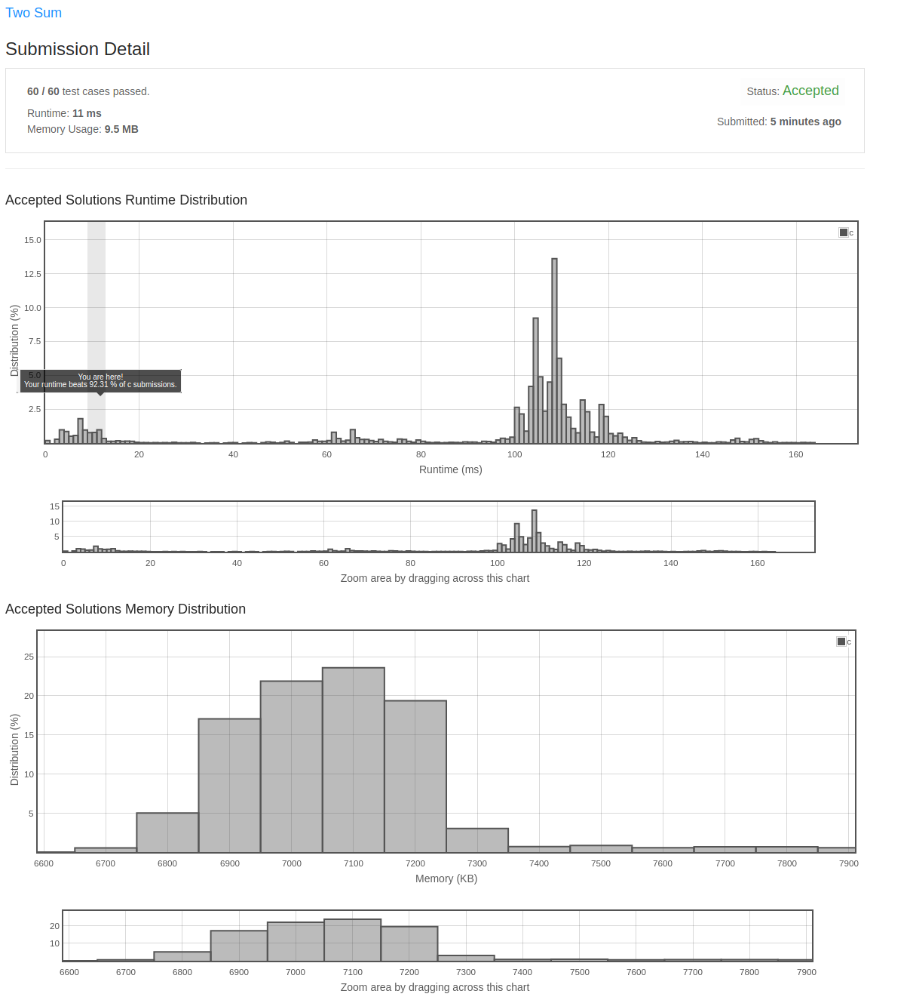

## Two Sum

### Description from Leet Code

Given an array of integers nums and an integer target, return indices of the two numbers such that they add up to target.

You may assume that each input would have exactly one solution, and you may not use the same element twice.

You can return the answer in any order.

### Some Examples

**Example 1:**

Input: nums = [2,7,11,15], target = 9
Output: [0,1]
Explanation: Because nums[0] + nums[1] == 9, we return [0, 1].

**Example 2:**

Input: nums = [3,2,4], target = 6
Output: [1,2]

**Example 3:**

Input: nums = [3,3], target = 6
Output: [0,1]

**Constraints:**

2 <= nums.length <= 104
-109 <= nums[i] <= 109
-109 <= target <= 109
Only one valid answer exists.

Follow-up: Can you come up with an algorithm that is less than O(n2) time complexity?

### My Solution

Last year sometime I made my solution to this and included it in a local repo.  I recently grabbed some commits from 
that repo and injected them into this new remote with some bug fixes ano other stuff.  I have a bunch of these problems 
that I plan to do the same for.

I also submitted my solution onto LeetCode and got the following report:

Runtime: 11 ms, faster than 92.31% of C online submissions for Two Sum.
Memory Usage: 9.5 MB, less than 5.32% of C online submissions for Two Sum.

